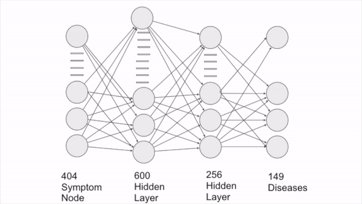
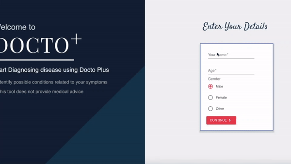
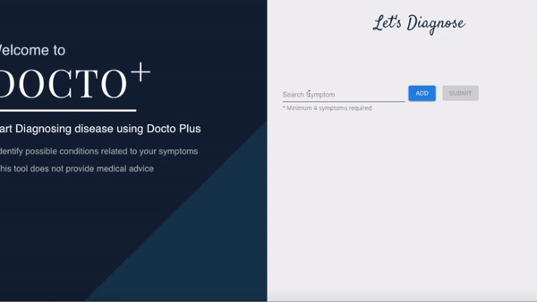
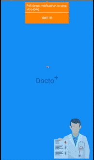

# Misdiagnosis detection using Deep Learning  
## The Problem 
- 52 lakh medical errors are happening in India annually (A Harvard study by Prof. Jha)
- This Medical errors counts among the top 10 Killer (WHO Report)
- This in turn sums to
     - 2,000 deaths every year from unnecessary surgery 
     - 7,000 deaths from medication errors in hospitals 
     - 80,000 deaths from Infection
     - 106,000 deaths from adverse effect of medication 
  - Which in total gives 225000 deaths per year single handedly only by misdiagnosis.
### THEREFORE, It's a big agenda , a curb suffocating the society

## Our Approach and Solution
- Mimicking like Human brain to see through patterns but robust and free from Confirmation bias.
- Solution : A deep learning model
- To make it available for ease : An Android and Web app.
- Our deep learning model computes the probability of happening of a disease from the given symptoms and orders them according   to their probability and in future creating a Reinforcement learning which in takes a feedback from the doctor, and learns      
 

## Screen Shots

 
 
 
